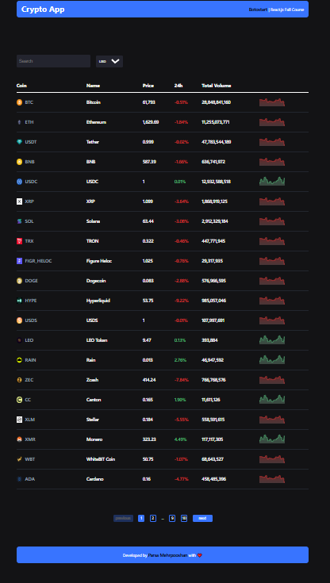
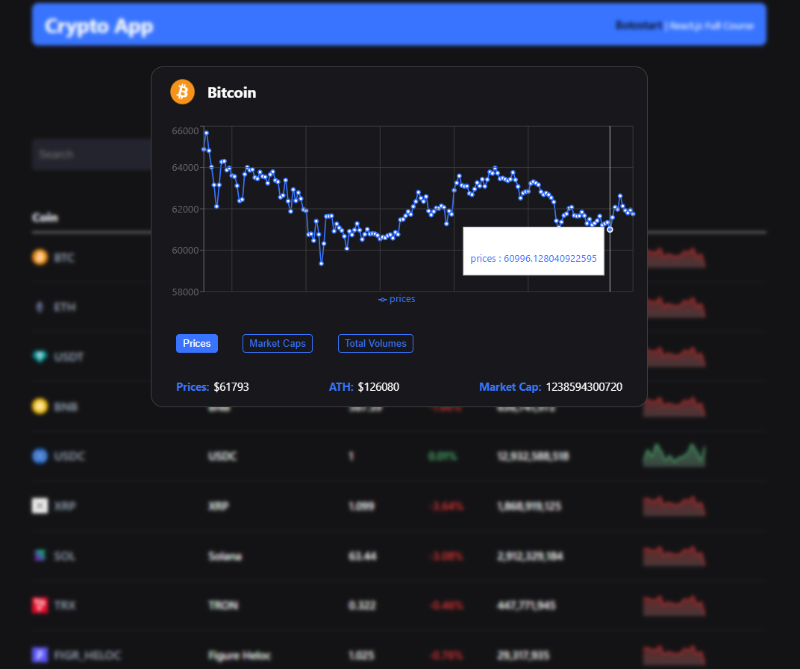

# Crypto App: وبسایت Crypto | ارز دیجیتال


## 🖼 دمو پروژه

🎥 دموی آنلاین پروژه (در حال آماده‌سازی...)

📸 پیش‌نمایش: 






## 🚀 تکنولوژی‌ها و ابزارهای استفاده‌شده

### ⚙️ تکنولوژی‌ها

* HTML
* CSS
* JavaScript
* React.js

---

## 🛠 روش نصب و اجرای پروژه

### 📥 نصب

1. کلون کردن ریپازیتوری:

```bash
git clone https://github.com/parsamehrpooshan/CryptoApp
```

2. ورود به پوشه پروژه:


```bash
cd project-name
```

3. نصب پکیج‌ها :


```bash
npm install
```


4. اجرای پروژه :


```bash
npm run dev
```

📍 سپس پروژه روی آدرس زیر در دسترس خواهد بود:

```
http://localhost:5173
```


## 📞 اطلاعات تماس

📩 ارتباط با من:

* Email: [parsamehrpooshan@gmail.com](mailto:example@gmail.com)

---

## ✅ نکات پایانی

* اگر پروژه را دوست داشتید، به ریپازیتوری استار بدید ⭐
